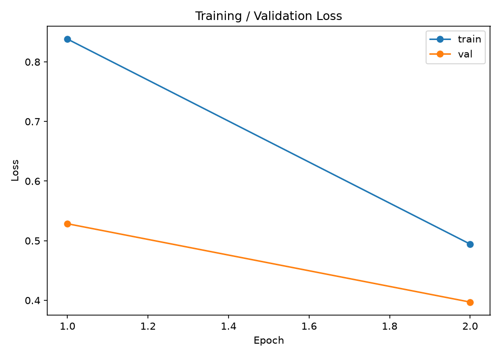
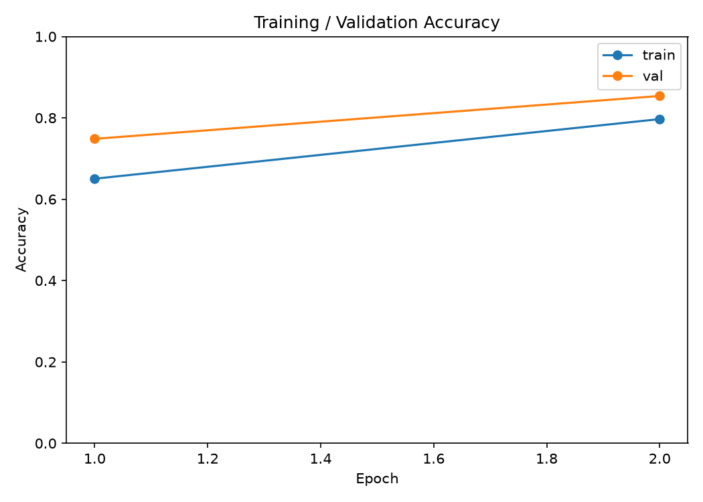
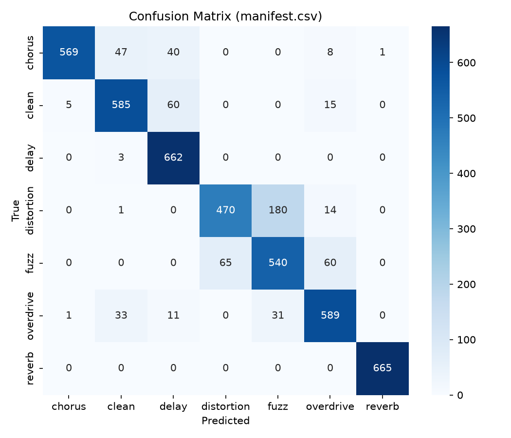

# Guitar Effect Classifier

A small end-to-end audio classification project for identifying common guitar effects from short audio clips. The current implementation combines synthetic dataset generation, audio preprocessing, pretrained audio embeddings, a lightweight PyTorch classifier, and a Streamlit demo.

## Objective

The goal of this project is to classify guitar recordings into common effect categories such as:

- clean
- overdrive
- distortion
- fuzz
- chorus
- delay
- reverb

The project is designed as a portfolio-style machine learning workflow with a clear structure for data generation, model training, evaluation, and inference.

## What is implemented so far

- Synthetic dataset generation using DSP-style effect processing
- Audio preprocessing utilities for resampling, mono conversion, normalization, trimming/padding, and log-mel extraction
- Dataset and dataloader support for waveform, log-mel, and Hugging Face embedding features
- Training and validation loops with checkpoint saving, including per-epoch metrics history and a best-epoch confusion matrix for later analysis
- Inference CLI for single-file prediction, auto-detecting the feature type a checkpoint was trained with
- A standalone evaluation script that generates loss/accuracy curve plots, a confusion matrix heatmap, and a per-file predictions report
- Streamlit demo app for interactive uploads and predictions
- Tests covering preprocessing, dataset loading, DSP effects, training, inference, and evaluation

## Project structure

- [app/streamlit_app.py](app/streamlit_app.py) — interactive Streamlit demo
- [scripts/generate_dataset.py](scripts/generate_dataset.py) — generate labeled synthetic audio data
- [scripts/install_idmt_guitar_dataset.py](scripts/install_idmt_guitar_dataset.py) — download/prepare the IDMT-SMT-Guitar dataset as a clean-source pool
- [scripts/predict.py](scripts/predict.py) — command-line inference entry point
- [scripts/evaluate.py](scripts/evaluate.py) — generates evaluation plots/reports for a trained checkpoint (run manually, not part of training)
- [src/audio_processing.py](src/audio_processing.py) — audio loading and feature extraction helpers
- [src/config.py](src/config.py) — shared constants (sample rate, effect classes, default pretrained model)
- [src/dataset.py](src/dataset.py) — dataset class for manifest-based loading
- [src/effects.py](src/effects.py) — DSP implementations of each guitar effect
- [src/features.py](src/features.py) — Hugging Face audio embedding wrapper
- [src/model.py](src/model.py) — classifier head definition
- [src/predict.py](src/predict.py) — inference logic and checkpoint loading
- [src/train.py](src/train.py) — training loop, checkpoint saving, and metrics history logging
- [src/utils.py](src/utils.py) — small helpers shared across scripts (mono downmixing, duration formatting)
- [data/](data/) — raw/generated audio and manifests (gitignored; regenerate locally)
- [models/](models/) — trained checkpoints (`*.pth`, committed) and per-run metadata (`*.json`, gitignored)
- [outputs/visualizations/](outputs/visualizations/) — default output location for `scripts/evaluate.py` (gitignored)
- [notebooks/](notebooks/) — reserved for exploratory analysis (currently empty)
- [tests/](tests/) — test suite covering preprocessing, dataset loading, DSP effects, training, inference, and evaluation

## Setup

This project uses Python 3.11 and Poetry.

1. Install Poetry if needed.
2. Create or select the project environment:

```bash
cd /workspaces/guitar-effect-classifier
poetry env use /usr/local/bin/python3
```

3. Install dependencies:

```bash
poetry install --with dev --with demo
```

4. Activate the environment if desired:

```bash
source .venv/bin/activate
```

## Install the IDMT-SMT-Guitar dataset locally

If you want to use the IDMT-SMT-Guitar collection as your clean-source pool, you can install it locally without committing any downloaded files to Git.

Preview the workflow first:

```bash
poetry run python scripts/install_idmt_guitar_dataset.py --dry-run
```

Then run the full setup:

```bash
poetry run python scripts/install_idmt_guitar_dataset.py \
  --dataset-ids 2,3,4 \
  --sample-rate 44100 \
  --bit-depth 16
```

This will:
- download the IDMT-SMT-Guitar Dataset into [data/downloads](data/downloads)
- extract the archive locally
- select clean WAV files matching the requested datasets
- copy them into [data/raw/idmt_smt_guitar](data/raw/idmt_smt_guitar)
- write a local manifest at [data/raw/idmt_smt_guitar/manifest.csv](data/raw/idmt_smt_guitar/manifest.csv)

**Arguments:**

| Flag | Default | Description |
|---|---|---|
| `--record-id` | `7544110` | Zenodo record ID for the IDMT-SMT-Guitar dataset |
| `--download-dir` | `data/downloads/idmt_smt_guitar` | Where downloaded archives are saved |
| `--output-dir` | `data/raw/idmt_smt_guitar` | Where selected WAV files are copied |
| `--dataset-ids` | `2,3,4` | Comma-separated IDMT dataset subsets to include |
| `--sample-rate` | `44100` | Expected sample rate, used for verification when copying |
| `--bit-depth` | `16` | Expected bit depth (`16`/`24`/`32`), used for verification when copying |
| `--source-archive` | none | Path to a local zip/tar.gz archive instead of downloading from Zenodo |
| `--manifest` | none | Path to a previously-written discovery manifest CSV to read instead of re-scanning archives |
| `--write-manifest` | none | Path to write a discovery manifest CSV of candidate files, for curation before copying |
| `--skip-verify` | off | Skip sample rate / bit depth verification when copying files |
| `--dry-run` | off | Print what would happen without downloading or copying anything |
| `--force-download` | off | Re-download archives even if they already exist locally |

## Generate synthetic data

Place clean guitar audio files under [data/raw](data/raw), then run:

```bash
poetry run python scripts/generate_dataset.py \
  --input-dir data/raw \
  --out-dir data/generated \
  --manifest data/manifest.csv
```

This will create processed audio files and a manifest CSV containing labels and effect parameters. Effect parameters are randomized per file (see `random_params_for` in the script); pass `--seed` (default `config.RANDOM_SEED`) to reproduce an identical dataset across runs.

Before writing anything, it prints an estimated output file count and disk size and asks for confirmation (based on each input file's duration, so it's cheap even for large inputs). Pass `--yes`/`-y` to skip the prompt for non-interactive use.

**Arguments:**

| Flag | Default | Description |
|---|---|---|
| `--input-dir` | `data/raw` | Directory of clean source WAV files to process |
| `--out-dir` | `data/generated` | Directory to write generated (effect-processed) WAV files |
| `--manifest` | `data/manifest.csv` | Path to write the output manifest CSV (filename/label/params) |
| `--sr` | `config.SAMPLE_RATE` (`32000`) | Sample rate for generated output audio |
| `--samples-per-input` | `1` | How many randomized-parameter variants to generate per input file, per effect |
| `--seed` | `config.RANDOM_SEED` (`42`) | Random seed, for reproducing an identical dataset across runs |
| `-y`, `--yes` | off | Skip the size-estimate confirmation prompt |

## Train the model

Training uses the manifest generated above:

```bash
poetry run python -m src.train \
  --manifest data/manifest.csv \
  --feature hf \
  --epochs 10 \
  --out-dir models
```

The default `--feature hf` extracts embeddings from [`MIT/ast-finetuned-audioset-10-10-0.4593`](https://huggingface.co/MIT/ast-finetuned-audioset-10-10-0.4593) (Audio Spectrogram Transformer, pretrained on AudioSet) — chosen over a speech model since it's pretrained on general, non-speech audio events, which better matches classifying guitar timbre. `--feature log-mel`/`--feature waveform` are also available (see [src/config.py](src/config.py) and `--help` for other options).

Runs are seeded (`--seed`, default `config.RANDOM_SEED`) for reproducible train/val splits and model initialization, and the classifier's `--hidden-dim`/`--dropout` are also configurable rather than fixed in code. Both default to values in [src/config.py](src/config.py).

A checkpoint is saved to `--out-dir` as `best.pth` whenever validation accuracy improves, alongside `training_history.json` (per-epoch loss/accuracy/precision/recall/F1) and `confusion_matrix.json` (the best epoch's validation confusion matrix) — both consumed by `scripts/evaluate.py` below.

**Arguments:**

| Flag | Default | Description |
|---|---|---|
| `--manifest` | `data/manifest.csv` | Manifest CSV to train on |
| `--feature` | `config.DEFAULT_FEATURE` (`hf`) | Feature type: `hf`, `log-mel`, or `waveform` |
| `--hf-model` | `config.DEFAULT_MODEL` | Hugging Face model to use when `--feature hf` |
| `--sr` | `config.SAMPLE_RATE` (`32000`) | Sample rate to load audio at |
| `--duration` | `config.AUDIO_DURATION` (`3.0`) | Clip duration in seconds (trim/pad) |
| `--epochs` | `5` | Number of training epochs |
| `--batch-size` | `16` | Batch size for both train and validation loaders |
| `--lr` | `1e-3` | Adam learning rate |
| `--val-split` | `0.1` | Fraction of the dataset held out for validation |
| `--out-dir` | `models` | Directory to write `best.pth`, `training_history.json`, `confusion_matrix.json` |
| `--hidden-dim` | `config.CLASSIFIER_HIDDEN_DIM` (`512`) | Classifier hidden layer size |
| `--dropout` | `config.CLASSIFIER_DROPOUT` (`0.3`) | Classifier dropout probability |
| `--seed` | `config.RANDOM_SEED` (`42`) | Random seed for reproducible split/init/training |
| `--no-cuda` | off | Force CPU even if CUDA is available |

## Run inference

Predict an effect from a single audio file. `--feature`/`--hf-model` are optional — they default to whatever the checkpoint was trained with:

```bash
poetry run python scripts/predict.py \
  --audio path/to/audio.wav \
  --checkpoint models/best.pth
```

**Arguments:**

| Flag | Default | Description |
|---|---|---|
| `--audio` | *(required)* | Path to the input audio file |
| `--checkpoint` | *(required)* | Path to a saved model checkpoint |
| `--feature` | checkpoint's recorded feature, else `config.DEFAULT_FEATURE` | Feature type: `hf`, `log-mel`, or `waveform` — overrides auto-detection |
| `--hf-model` | checkpoint's recorded model, else `config.DEFAULT_MODEL` | Hugging Face model to use when the feature is `hf` |
| `--sr` | `config.SAMPLE_RATE` (`32000`) | Sample rate to load audio at |
| `--duration` | `config.AUDIO_DURATION` (`3.0`) | Clip duration in seconds (trim/pad) |
| `--topk` | `3` | Number of top predictions to display |
| `--use-cuda` | off | Use CUDA if available |

## Evaluate the model

Generate evaluation visualizations and a per-file predictions report for a trained checkpoint. This is a manual analysis step — it does not run automatically as part of training:

```bash
poetry run python scripts/evaluate.py \
  --checkpoint models/best.pth \
  --manifest data/manifest.csv
```

This writes to `outputs/visualizations/` (override with `--out-dir`):
- `loss_curve.png` / `accuracy_curve.png` — from the checkpoint's `training_history.json`
- `confusion_matrix.png` — recomputed fresh over `--manifest` (or, if `--manifest` is omitted, read from the checkpoint's saved `confusion_matrix.json`)
- `predictions.csv` — per-file true/predicted label, confidence, and top-k breakdown (only when `--manifest` is given)

It also prints overall accuracy and a handful of correct/incorrect example predictions to the console.

**Arguments:**

| Flag | Default | Description |
|---|---|---|
| `--checkpoint` | `models/best.pth` | Path to the trained checkpoint to evaluate |
| `--manifest` | none | Recompute the confusion matrix and `predictions.csv` over this manifest CSV |
| `--history` | `training_history.json` next to `--checkpoint` | Path to the training history JSON used for the loss/accuracy curves |
| `--confusion-matrix` | `confusion_matrix.json` next to `--checkpoint` | Fallback confusion matrix source when `--manifest` isn't given |
| `--out-dir` | `outputs/visualizations` | Directory to write plots and `predictions.csv` |
| `--sr` | `config.SAMPLE_RATE` (`32000`) | Sample rate to load audio at |
| `--duration` | `config.AUDIO_DURATION` (`3.0`) | Clip duration in seconds (trim/pad) |
| `--topk` | `3` | Number of top predictions recorded per file in `predictions.csv` |
| `--num-examples` | `5` | Number of correct/incorrect example predictions to print to the console |
| `--use-cuda` | off | Use CUDA if available |

## Results

Example end-to-end run against IDMT-SMT-Guitar-sourced recordings (see [Install the IDMT-SMT-Guitar dataset locally](#install-the-idmt-smt-guitar-dataset-locally)), generating 5 randomized variants per effect per source file:

```bash
poetry run python scripts/generate_dataset.py --input-dir data/raw --out-dir data/generated --manifest data/manifest.csv --sr 44100 --samples-per-input 5
poetry run python -m src.train --manifest data/manifest.csv --feature hf --epochs 2 --out-dir models
poetry run python scripts/evaluate.py --checkpoint models/best.pth --manifest data/manifest.csv
```

This produced a perfectly balanced dataset of 4,655 examples (665 per class) and, after 2 epochs of training a classifier head on frozen AST embeddings:

**87.65% accuracy** (4,080/4,655 correct) evaluating the trained checkpoint back over the full generation manifest.

> **Caveat:** that figure comes from `scripts/evaluate.py --manifest data/manifest.csv` scoring against the *entire* manifest, which includes the ~90% of examples the model was trained on (`--val-split` defaults to 0.1) — it's not a clean held-out test score. The more honest "unseen data" number is the epoch 2 **validation accuracy: 85.4%** (table below). A proper train/val/test split with a persisted held-out set is listed under [Future improvements](#future-improvements).

### Per-epoch metrics

From `models/training_history.json`:

| Epoch | Train Loss | Train Acc | Val Loss | Val Acc | Precision | Recall | F1 |
|---|---|---|---|---|---|---|---|
| 1 | 0.838 | 65.0% | 0.528 | 74.8% | 0.786 | 0.757 | 0.731 |
| 2 | 0.494 | 79.7% | 0.397 | 85.4% | 0.864 | 0.860 | 0.859 |

Both loss and accuracy were still improving at epoch 2 with no sign of plateauing — more epochs would likely improve results further.

On the machine this was run on, these 2 epochs took **~2 hours** end to end (CPU, no GPU flags used). That's slow for 4,655 examples/epoch, and is expected: `--feature hf` recomputes AST embeddings from scratch for every sample on every epoch (nothing caches them, since the backbone is frozen and its output never changes), on a single-process `DataLoader`. Caching embeddings after the first pass — or extracting them once as a preprocessing step — would substantially cut this down; see [Future improvements](#future-improvements).





### Confusion matrix



**Reverb (100%, 665/665) and delay (99.5%, 662/665)** are classified almost perfectly — both have distinctive time-domain signatures (a convolution tail, a discrete echo) that are easy to separate from the rest. The dominant confusion is **distortion vs. fuzz**: 180 of 665 distortion examples (27%) were predicted as fuzz, and 65 of 665 fuzz examples (10%) were predicted as distortion — both are aggressive gain-stage/clipping effects with overlapping harmonic content, which is exactly the kind of failure mode flagged when this project was first reviewed against its original spec. There's smaller secondary bleed: chorus and clean both draw a meaningful number of predictions toward delay (40 and 60 respectively), and overdrive bleeds into clean (33) and fuzz (31).

Full per-file predictions (filename/true/predicted/confidence/top-k) are written to `outputs/visualizations/predictions.csv` by `scripts/evaluate.py` — gitignored since it's regenerable per-run output; rerun the commands above to reproduce it.

## Run the Streamlit demo

Start the interactive demo with:

```bash
poetry run streamlit run app/streamlit_app.py
```

Upload a WAV/MP3/FLAC file, select a checkpoint, and run inference from the browser UI.

## Run tests

```bash
poetry run pytest -q
```

## Notes

- The current implementation focuses on a lightweight and reproducible training pipeline rather than a fully tuned production model.
- The demo app expects a checkpoint at [models/best.pth](models/best.pth) by default, so update the path if you save checkpoints elsewhere.
- Trained checkpoints (`models/*.pth`) are committed to version control; per-run metadata (`models/*.json` — `training_history.json`, `confusion_matrix.json`) and evaluation outputs (`outputs/*`) are gitignored as regenerable artifacts.
- The repository currently targets Python 3.11 for the devcontainer and Poetry environment.

## Future improvements

- Persist an explicit held-out test split (separate from the train/val split used during training) so `scripts/evaluate.py` can report a trustworthy test accuracy instead of scoring against the full training manifest — see the caveat in [Results](#results).
- Train for more than 2 epochs — loss/accuracy were still improving with no sign of plateauing.
- Cache AST embeddings (or extract them once as a preprocessing pass) instead of recomputing them from scratch every epoch — the current `--feature hf` path took ~2 hours for 2 epochs on 4,655 examples on CPU, almost entirely re-extraction cost.
- Investigate the distortion/fuzz confusion seen in the [Results](#results) confusion matrix — possibly tighter/less-overlapping parameter ranges in `random_params_for` (`scripts/generate_dataset.py`), or an explicit feature more sensitive to clipping harmonics.
- Add an architecture diagram.
- Extend `scripts/generate_dataset.py` to window/segment long source recordings into multiple clips, and/or apply waveform-level augmentation (gain jitter, pitch/time shift, noise) before effects are applied, for more training diversity than effect-parameter randomization alone.
- Compare the AST embedding backbone against BEATs/CLAP now that the feature-extraction path is model-agnostic.
